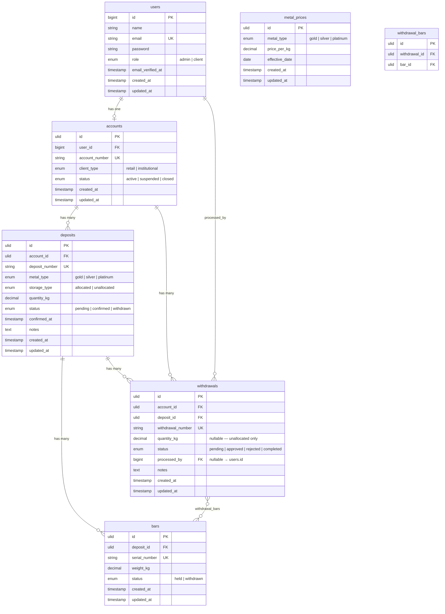

# Data Model

## Notes

- `users.id` is auto-increment `bigint` (existing Fortify table).
- All other domain table PKs are ULIDs (`HasUlids` trait).
- `metal_prices` has a unique constraint on `(metal_type, effective_date)`.
- `withdrawal_bars` is a bare pivot — no timestamps, no extra columns.
- Retail accounts may only create **unallocated** deposits. Institutional accounts may create both types.
